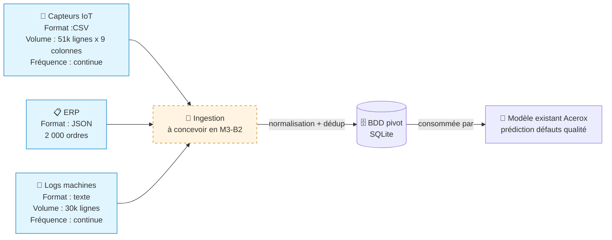

# Schéma des flux de données — Acerox Métallurgie

> Schéma Mermaid à compléter. Doit montrer :
> - **Sources** (capteurs IoT, ERP, logs, *bonus PDF*)
> - **Ingestion** (à concevoir en M3-B2)
> - **BDD pivot** (à modéliser en M3-B2)
> - **Modèle existant** Acerox (placeholder, hors-sujet ici)
>
> Légende explicite : qui produit, qui consomme, contraintes.

## Schéma

## Légende

> Reformule en 5 lignes max ce que le schéma raconte (qui produit quelle
> donnée, qui consomme, contraintes critiques).

- **Producteur** : les capteurs IoT (mesures machines), l’ERP (ordres de fabrication) et les logs machines (événements techniques) produisent les données sources.
- **Consommateur final** :  le modèle existant Acerox, utilisé pour prédire les défauts qualité.
- **Contraintes critiques** (fréquence / RGPD / qualité) : vigilance sur `ouvrier_id` (ERP) et événements opérateurs (logs) car risque de réidentification par croisement.

## Décisions associées

- Source(s) retenues en priorité : 
  - `capteurs_iot.csv` : données techniques essentielles pour détecter les dérives machines.
  - `erp_export.json` : contexte des ordres de fabrication, indispensable pour relier défauts et production.

- Source(s) écartées : Aucune source écartée à ce stade.
- Source bonus (PDF) traitée ? oui / non, pourquoi : Non, pertinente uniquement pour de la recherche sémantique (RAG) en aide au diagnostic, pas pour la prédiction tabulaire.

---

*Schéma produit par <Joelle>, <30/06/2026>, dans le cadre du brief M3-B1 ATOS.*
